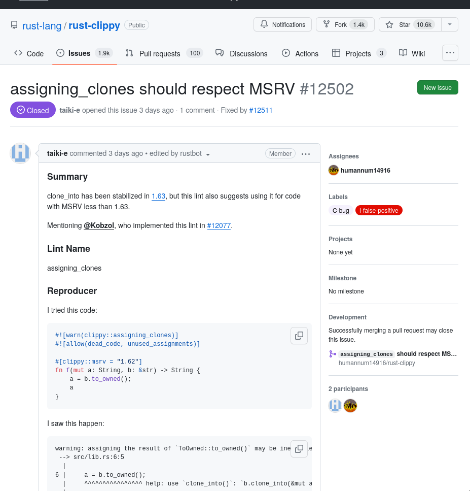
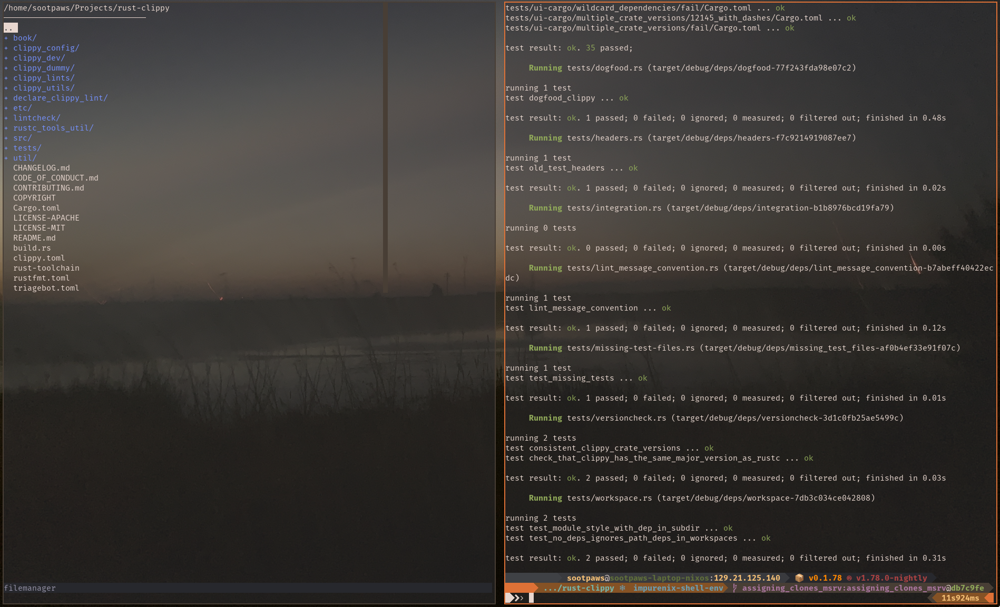
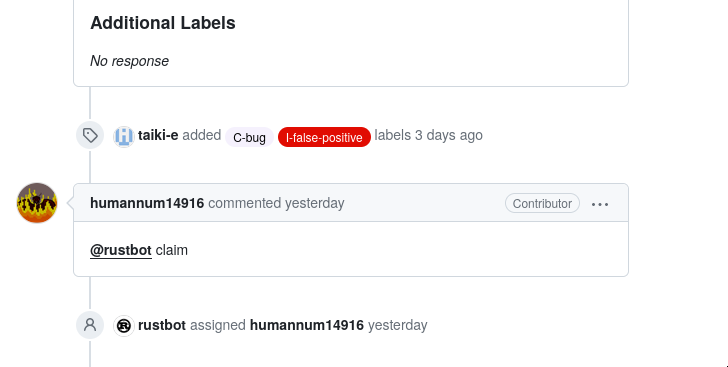
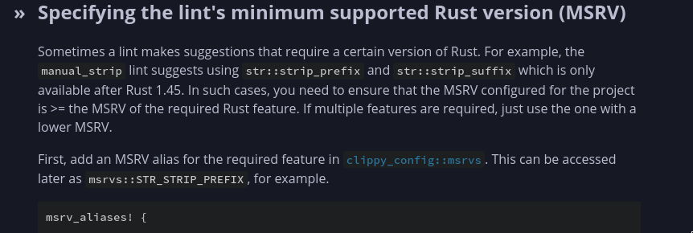
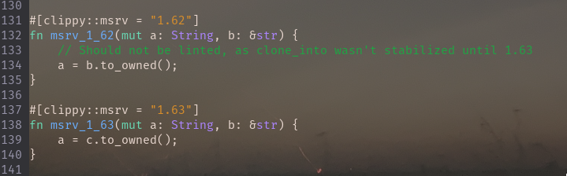
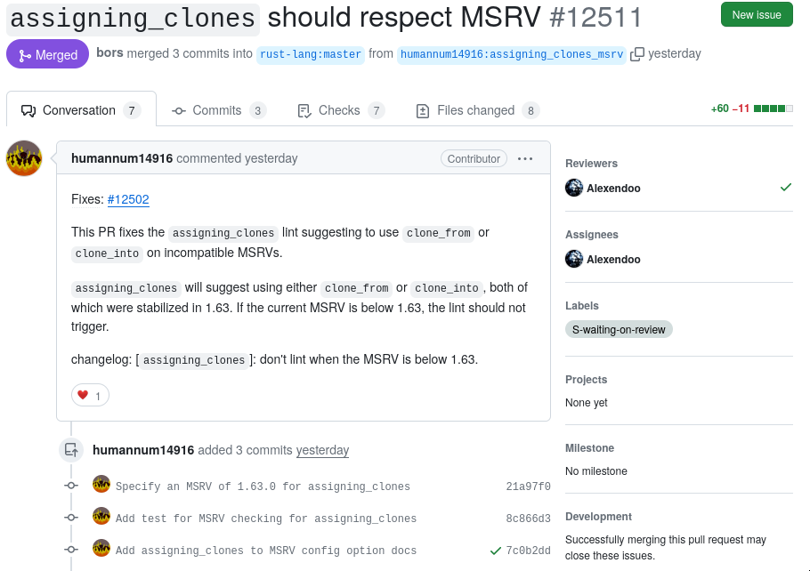
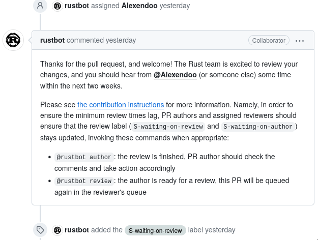
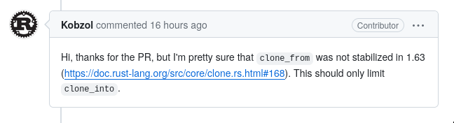
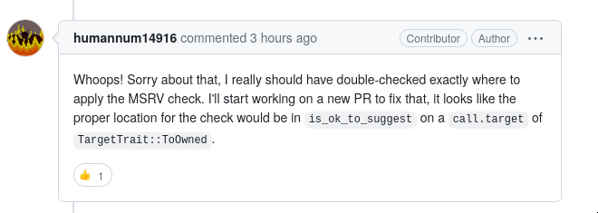
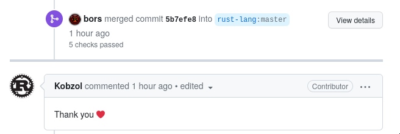

# Clippy: What and Why

Clippy is a tool known as a linter, which reads through your source code and
suggests improvements where your code is suboptimal in various ways. It's the
standard linter for the Rust programming language, and is maintained as a part
of the Rust project at
[https://github.com/rust-lang/rust-clippy](https://github.com/rust-lang/rust-clippy).
I chose to contribute to Clippy because it's a tool I'm already familiar with
and use very frequently, it's written in a language (Rust) I'm comfortable
working with, and it was suggested as a good starting point for contributing
to Rust without having to jump directly into working on the much
more complex compiler.

# Community Evaluation

Clippy is a sub-project of Rust, and shares much of the same community
resources, such as their
[Code of Conduct](https://rustc-dev-guide.rust-lang.org/getting-started.html)
and contribution guidelines/procedure. The federation-style community is very
structured, with 17 different
[teams and working groups](https://www.rust-lang.org/governance), a formal
[RFC process](https://rust-lang.github.io/rfcs/), and
[heavily automated](https://rustc-dev-guide.rust-lang.org/rustbot.html)
contribution workflows. As a Rust user, I've been tangentially involved in the
community for a while, and it's been a great experience so far. As for
contribution resources, there's not only a lot of documentation on making
pull requests and using the various Github bots, but an
[entire book](https://rustc-dev-guide.rust-lang.org/) on the internals of the
compiler, and a
[similar guide](https://doc.rust-lang.org/clippy/development/index.html) for
Clippy. The Clippy development guide in particular was extremely helpful, since
it covered how to do the changes I ended up working on.

# Choosing an issue

I wanted to start with something small that I could quickly fix without having
to get too deep into interfacing with the compiler, so I opened up the issues
tab on Github and started searching for one that looked good. One of the most
recent issues,
["assigning_clones should respect MSRV"](https://github.com/rust-lang/rust-clippy/issues/12502),
seemed good: it was a relatively minor bug that had a simple fix, it didn't
have anyone assigned to it yet, and althouth it didn't have the
`good-first-issue` tag, I felt confident that I could do it.

# Fixing the bug

The first step was to get set up to do the development: this meant forking the
repo, cloning the fork, and making sure building locally worked and all the
tests passed. I had a little trouble getting the right packages installed
(NixOS can be like that sometimes), but other than that it was as simple as
`git clone`, `cargo build`, `cargo test`.

The next step was to "claim" the issue and mark myself as assigned to work on
it. This was done using a command on one of the Github bots:

With the issue claimed and my local development environment set up, I started
working on actually fixing the issue. The problem was relatively simple: a
particular lint was suggesting to use the method `clone_into`, which was only
stabilized in Rust 1.63, without checking if the code being linted specified a
Minimum Supported Rust Version, or MSRV, before 1.63. This lead to it suggesting
to use `clone_to` in situations it shouldn't be used to maintain compatablity
with older versions of Rust. Luckilly, the fix seemed simple: don't run the lint
if the current code specified an MSRV below 1.63. This is a common behaviour to
want a lint to have, enough that it has
[its own section](https://doc.rust-lang.org/clippy/development/adding_lints.html#specifying-the-lints-minimum-supported-rust-version-msrv)
in the Clippy development book.

Adding the MSRV check ended up involving adding a few bits of code scattered
across a few different files: declaring the required MSRV, adding an MSRV to the
lint's configuration, the actual check code, and directing the lint to properly
handle situations where a section of code has an explicitly-set MSRV. Once the
implementation of the fix was in, the last step was to write new tests to
confirm it all worked.

The tests are just a pair of functions with specified MSRVs, contaning identical
code that should only trigger the lint in the MSRV 1.63 function. The test
system runs Clippy over the test code and compares the output to a known-good
version, so I had to update that once I confirmed everything worked as expected.

# The pull request

Now that the fix was implemented, I pushed it back to my fork on Github and
started writing a pull request. The provided template explained how to link the
addressed issue and add a changelog, although it didn't provide much in the way
of the overall structure. I ended up looking at a few other pull requests as
examples, and then wrote and
[submitted my own](https://github.com/rust-lang/rust-clippy/pull/12511).

Immidiately, one of the Github bots assigned a reviewer, added a "waiting on
review" tag, and sent a message welcoming me to the project.

Only a few hours later, the assigned reviewer approved the pull request, and it
was merged into the main branch.

Bug fixed, code merged, issue closed - we're done, mission success!

# Not so fast...

I returned the next day to a comment on my pull request from the original author
of the lint:

Uh oh. So, it turns out the lint doesn't just emit suggestions to use
`clone_to`, and will also suggest using `clone_from` in a different set of
cases. In disabling the lint below MSRV 1.63, I disabled not only the improper
suggestions, but also correct ones as well. Better fix that.

# Fixing the fix

The first thing I did was respond to let them know I was working on a fix:

Now that they knew I wasn't ghosting them after submitting a faulty bug fix, I
got to work making the MSRV check apply correctly. The change ended up being a
lot simpler than I expected - there was already a function `is_ok_to_suggest`
that checks if a given pice of code should be linted. Since it aleady had access
to whether the suggested function would be `clone_from` or `clone_to`, so I had
to do was pass the MSRV to it and put the check there. I also updated the tests
I had written to confirm that `clone_from` suggestions were no longer affected
by the MSRV. Just like last time, submtting
[the PR](https://github.com/rust-lang/rust-clippy/pull/12516) went smoothly,
and it was merged a few hours later.

# Conclusion

This was my first time contributing to a major open-source project, and overall
I'd say it went quite well. The onboarding, contribution, and development
documentation was incredibly helpful, and the community was very welcoming and
forgiving even when I made a (in hindsight) quite obvious mistake. The process
of making this contribution got me lot more familiar with how Clippy works
internally, and I'm definitely going to try and contribute more in the future.
